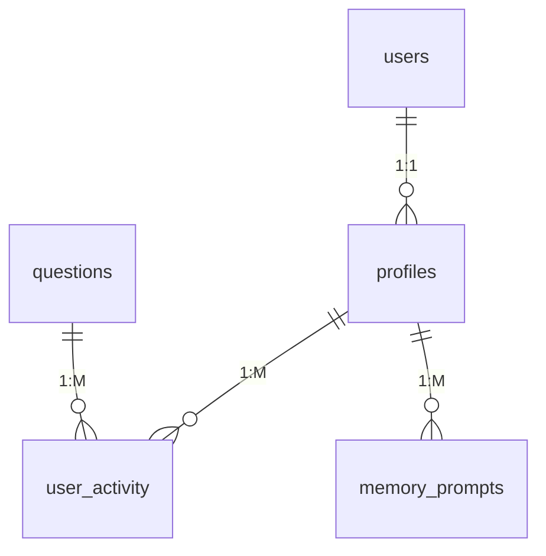

# Memory-Master_PRD_v2

This document outlines the product requirements for **Tägliche Gedächtnis-Challenge** (Daily Memory Challenge) and serves as a roadmap to build a full-featured cognitive training application for seniors. This version has been updated to reflect recent code changes such as Supabase authentication and database integration, new routes and pages, middleware protection, CSV-based question imports, and additional UI components.

---

# 1. Product Overview

## 1.1 Product Name (Working Title)

**Tägliche Gedächtnis-Challenge** (Daily Memory Challenge)

## 1.2 Purpose & Summary

A cross-platform (web + mobile-responsive) application designed to offer daily cognitive training for seniors. Key features include:

- **Adaptive Questioning:** Adjusts quiz difficulty based on the user’s current mood (sad, neutral, happy).
- **Dual Session Workflow:** A morning session to capture a short memory prompt and an evening session to recall that prompt.
- **Supabase Integration:** Handles user authentication, profiles, and real-time data storage (quiz activity, memory prompts, etc.).
- **Personalized Experience:** Greets users by name and displays current time using dedicated UI components.
- **Comprehensive Reporting:** Provides a daily report summarizing quiz performance and memory recall.
- **Accessible Design:** Features large fonts, high-contrast themes (supporting both light and dark modes), and optional audio enhancements.
- **CSV-based Question Bank:** Utilizes external CSV/Excel files for a robust, importable question bank.

## 1.3 Goals & Scope

### **Goals:**

- **User Engagement:** Offer an intuitive, engaging cognitive workout that’s simple enough for seniors.
- **Performance Tracking:** Monitor daily progress through adaptive quizzes and memory recall.
- **Personalization:** Allow family members (optional) to contribute custom content, and provide personalized greetings based on profile data.
- **Robust Data Management:** Seamlessly integrate with Supabase for authentication and real-time data storage.

### **In Scope:**

- **User Authentication:** Login/registration via Supabase (with session persistence and auto-refresh).
- **Mood Selection:** A dedicated flow that captures the user’s mood and personalizes subsequent quiz difficulty.
- **Category Selection & Quiz:** Allow users to choose from multiple categories (Mathe, Geografie, Geschichte, Logik, Wortschatz, Trivia) and dynamically fetch questions based on mood and category.
- **Memory Workflow:**
    - **Morning Prompt:** Users input a short phrase which is stored in the database.
    - **Evening Recall:** Users attempt to recall the morning prompt; their performance is logged.
- **Daily Reporting:** Summarizes user activity (quiz answers, mood, memory recall) and displays a daily report.
- **UI Enhancements:** Implementation of components like TimeDisplay and UserDisplay for real-time feedback.
- **Middleware Protection:** Secure protected routes via middleware that redirects users based on their authentication state.
- **CSV/Excel Integration:** Provides several files for question bank imports, supporting ongoing content updates.

### **Out of Scope (for MVP):**

- Advanced gamification (badges, leaderboards).
- Multi-language support beyond German.
- Complex analytics dashboards beyond a simple daily report.
- Extensive audio features (beyond optional TTS/voice input, marked as Beta).

---

# 2. Technical Stack & Tools

| Component | Technology |
| --- | --- |
| Frontend Framework | Next.js 15.2 (App Router) |
| Authentication | Supabase Auth |
| Database | Supabase PostgreSQL |
| Styling | CSS Modules + Tailwind |
| State Management | localStorage + Supabase RT |
| Deployment | Vercel |
- **Frontend Framework:**
    - **Next.js v15.2.0:** Uses the modern app directory with file-based routing.
    - **React & TypeScript:** For robust, type-safe UI development.
- **Styling:**
    - **Tailwind CSS & PostCSS:** For utility-first styling, responsive layouts, and theme management.
    - **CSS Modules:** Used for page-specific styles.
- **Backend & Database:**
    - **Supabase:**
        - Authentication via `@supabase/auth-helpers-nextjs` with persistent sessions and auto-refresh.
        - Data storage for quiz questions, user activity, memory prompts, and user profiles.
        - The database schema is documented in `docs/supabase_database_structure.md`.
- **Deployment & Hosting:**
    - **Vercel:** Seamless deployment and integration with Next.js.
- **Additional Tools:**
    - **CSV/Excel Files:** Multiple files in the `docs/` folder (e.g., `questions.csv`, `questions2.csv`, etc.) support a flexible question bank.
    - **Middleware:** Implements route protection and redirection based on authentication state.
    - **UI Components:** Custom components like TimeDisplay and UserDisplay enhance user experience.
    - **Debugging:** A debug panel in the Quiz page aids during development (this can be removed in production).

---

# 3. High-Level User Flows

## 3.1 Authentication & Registration

### **Process:**

1. User navigates to **/login**.
2. Enters email and password.
3. Supabase handles authentication via `signInWithPassword` (or `signUp` for new users).
4. Upon success, users are redirected (via middleware and client-side routing) to the **Mood Selection** page.

### **Enhancements:**

- **Auth Callback:** A dedicated callback route (`/auth/callback`) exchanges OAuth codes for sessions.
- **Middleware Protection:** Routes are guarded to redirect unauthenticated users to **/login** and redirect logged-in users away from **/login** to **/mood-selection**.

## 3.2 Mood Selection

**Process:**

1. On **/mood-selection**, users choose their mood (options: “sad”, “neutral”, “happy”).
2. Their selection is stored in local storage and may be logged in `user_activity`.
3. Personalized greeting is displayed using the user’s first name from the **profiles** table.
- **Outcome:** Mood setting influences quiz difficulty.

## 3.3 Category Selection & Quiz

- **Process:**
    1. On **/category-selection**, users select one or more quiz categories.
    2. Their choices are stored locally.
    3. On **/quiz**, questions are fetched from the **questions** table filtered by:
        - Selected categories (mapped from IDs to names).
        - Difficulty level based on the user’s mood.
    4. Questions are shuffled and presented one at a time.
    5. User answers are processed, with correct/incorrect outcomes logged in `user_activity`.
    6. A debug panel (for development) provides real-time state feedback.
- **Outcome:** Score is tallied, and activity is recorded.

## 3.4 Memory Workflow

- **Morning Prompt:**
    - On **/memory-prompt**, users enter a short phrase (up to 100 characters) that is stored in the **memory_prompts** table.
- **Evening Recall:**
    - On **/evening-recall**, users attempt to recall their morning prompt.
    - The system compares their response (case-insensitively) with the stored prompt.
    - The result (correct/incorrect) and timestamp are updated in **memory_prompts**.

## 3.5 Daily Report

- **Process:**
    1. On **/report**, the application fetches the latest `user_activity` and `memory_prompts` records for the user.
    2. The report summarizes:
        - Quiz performance (question IDs, scores, mood, timestamps).
        - Memory recall results.
- **Outcome:** Users receive a concise daily report on their performance.

---

# 4. Database Schema (Supabase)

The database now fully integrates with Supabase and includes several key tables. Refer to `docs/supabase_database_structure.md` for the complete schema details.

**Key Tables:**



**Table Specifications:**

- `questions`: Stores quiz content with difficulty levels
- `user_activity`: Tracks all user interactions
- `memory_prompts`: Manages daily memory challenges

## 4.1 Supabase Auth & Profiles

### **`auth.users`:**

- Managed by Supabase, stores core authentication data (UUID, email, encrypted_password, created_at, etc.).

| **Column** | **Type** | **Description** |
| --- | --- | --- |
| id | uuid | Primary Key for each authenticated user. |
| email | text | User's email address. |
| encrypted_password | text | Password hash (not directly visible). |
| ... | *varies* | Other Supabase-managed fields. |

### **`profiles`:**

- **Columns:** `user_id` (PK, references `auth.users`), `first_name`, `last_name`, `email`, `date_of_birth`, etc.
- **Purpose:** Stores additional user details for personalization.

| **Column** | **Type** | **Description** |
| --- | --- | --- |
| **user_id** | `uuid` | **Primary Key**, references`auth.users (id)`. |
| **email** | `text` | Optional mirror of the user's email. |
| **created_at** | `timestamptz` | Timestamp for profile creation. |
| **first_name** | `text` | User's given name. |
| **last_name** | `text` | User's family name. |
| **date_of_birth** | `date` | User's DOB if needed. |

## 4.2 Quiz & Activity Data

### **`questions`:**

- **Columns:** `id` (PK), `kategorie` (category name), `frage` (question), `antwortoptionen` (array of answers), `korrekte_antwort`, `schwierigkeitsgrad`, `tag`, `erklaerung`.
- **Purpose:** Acts as the question bank.

| **Column** | **Type** | **Description** |
| --- | --- | --- |
| **id** | `serial` | **Primary Key**(auto-increment). |
| **kategorie** | `text` | Category (e.g., "Mathe", "Geografie"). |
| **frage** | `text` | The question prompt (German). |
| **antwortoptionen** | `text[]` | Array of multiple-choice answers. |
| **korrekte_antwort** | `text` | The correct answer. |
| **schwierigkeitsgrad** | `int4` | Difficulty (1 = leicht, 2 = mittel, 3 = schwer). |
| **tag** | `text` | Optional tag for filtering. |
| **erklaerung** | `text` | Optional explanation/hint. |

### **`user_activity`:**

- **Columns:** `id`, `user_id` (references profiles), `question_id` (optional), `mood`, `score`, `timestamp`, `session_type`.
- **Purpose:** Logs quiz activity and daily interactions.

| **Column** | **Type** | **Description** |
| --- | --- | --- |
| **id** | `serial` | **Primary Key**(auto-increment). |
| **user_id** | `uuid` | References`profiles(user_id)`. |
| **question_id** | `int4` | (Optional) References`questions.id`. |
| **mood** | `text` | "sad", "neutral", "happy". |
| **score** | `int4` | 0 or 1 (correct/incorrect), or points. |
| **timestamp** | `timestamptz` | Time the user answered. |
| **session_type** | `text` | "morning", "evening", "quiz". |

### **`memory_prompts`:**

- **Columns:** `id`, `user_id`, `prompt_text`, `created_at`, `recalled_text`, `recall_score`, `checked_at`.
- **Purpose:** Stores the morning prompt and the evening recall attempt.

| **Column** | **Type** | **Description** |
| --- | --- | --- |
| **id** | `serial` | **Primary Key**(auto-increment). |
| **user_id** | `uuid` | References`profiles(user_id)`. |
| **prompt_text** | `text` | The 3 words (or short phrase). |
| **created_at** | `timestamptz` | Timestamp (morning). |
| **recalled_text** | `text` | User's evening recall attempt. |
| **recall_score** | `int4` | Score (0 = incorrect, 1 = correct). |
| **checked_at** | `timestamptz` | Timestamp (evening). |

---

# 5. Detailed Features & Components

## 5.1 Mood-Based Adaptive Difficulty

- **Frontend**:
    - **MoodSelection** component: Three large buttons (sad, neutral, happy).
    - Store mood in localStorage.
- **Backend Logic**:
    - If `mood` = "sad", fetch fewer/simpler questions (`difficulty`=1).
    - If `mood` = "neutral", fetch moderate difficulty (`difficulty`=2, 3).
    - If `mood` = "happy", fetch more/harder questions (`difficulty`=2, 3, more of 3).

## 5.2 Category Selection & Quiz

- **Frontend**:
    - **CategorySelector**: Buttons with icons for each category.
    - **QuizPage**:
        - One question at a time.
        - Progress indicator.
        - "Next" and "Previous" navigation (to be implemented).
    - Automatic scoring and activity logging.
- **Backend Query**:
    - Query `questions` based on selected categories and difficulty.

## 5.3 Memory Prompt (Morning/Evening)

- **Frontend**:
    - **MorningPrompt**: Text input for the user's 3 words.
    - **EveningRecall**: Input field for recall.
- **Logic**:
    - String comparison.
    - Save result (`recall_score`) to `memory_prompts`.

## 5.4 Reporting & Scoring

- **Daily Report**: Summarize correct answers, memory recall, mood.
- **Implementation**: Query `user_activity` and `memory_prompts`.

## 5.5 Accessibility (Audio I/O)

- **Text-to-Speech**: Use the **Web Speech API** (`speechSynthesis`).
- **Speech-to-Text**: Use the **Web Speech API** (`webkitSpeechRecognition`).

## 5.6 Custom Content (Family Portal) - Optional MVP

- **FamilyMemberLogin**: Separate role in `users.role`.
- **CustomQuestionEditor**: Create new questions.

---

# 6. Folder Structure

The project follows a modular, file-based routing structure using Next.js’s app directory. Key folders include:

```

memory-master/
├─ docs/
│   ├─ Memory-Master_PRD v1.md         # Previous PRD document (for historical reference)
│   ├─ folders-structure_v1.md          # Folder organization guidelines
│   ├─ questions.csv, questions2.csv, …  # Question bank files (CSV/Excel)
│   └─ supabase_database_structure.md   # Detailed DB schema
├─ public/                              # Static assets (icons, images)
├─ src/
│   ├─ app/
│   │   ├─ globals.css                   # Global styles (Tailwind + theme variables)
│   │   ├─ layout.tsx                    # Root layout; imports fonts, TimeDisplay, UserDisplay
│   │   ├─ page.tsx                      # Landing page (redirects based on session)
│   │   └─ (routes)/                    # All page routes:
│   │       ├─ login/                   # Login page
│   │       ├─ mood-selection/          # Mood selection flow
│   │       ├─ category-selection/      # Category selection
│   │       ├─ quiz/                    # Quiz interface
│   │       ├─ memory-prompt/           # Morning memory prompt
│   │       ├─ evening-recall/          # Evening recall
│   │       └─ report/                  # Daily report page
│   │   └─ auth/callback/              # Auth callback route for OAuth
│   ├─ components/                      # Reusable UI components (TimeDisplay, UserDisplay, etc.)
│   ├─ lib/
│   │   └─ supabaseClient.ts            # Supabase client initialization and configuration
│   ├─ utils/
│   │   └─ apiHelpers.ts                # Helper functions for API and DB queries
│   ├─ middleware.ts                    # Middleware for route protection
│   ├─ next.config.ts, tsconfig.json, etc.
└─ package.json, README.md, postcss.config.mjs, eslint.config.mjs

```

---

# 7. Implementation Status & Actionable Steps

## Current Status (Implemented):

- **Project Initialization:** Done.
- **Supabase Setup:**
    - **Client:** Implemented (`lib/supabaseClient.ts`).
    - **Database Schema:** *Not Yet Executed in Supabase*. Schema is defined in `docs/supabase_database_structure.md`.
- **Authentication:**
    - **Login:** Implemented.
    - **Registration:** *Not Implemented*.
    - **Auth Callback:** Implemented.
    - **Middleware:** Implemented.
    - **User Display:** Implemented.
- **Mood Selection:** Implemented.
- **Category Selection:** Implemented.
- **Quiz Functionality:**
    - **Fetching:** Implemented.
    - **Display:** Implemented.
    - **Answering:** Implemented, with logging and a debug panel.
- **Morning Prompt:** Implemented.
- **Evening Recall:** Implemented.
- **Reporting:** Implemented.
- **Accessibility Features:** Basic dark/light mode and `TimeDisplay` are implemented.
- **Family/Custom Content:** *Not Started*.

## Prioritized Actionable Steps:

1. **Create Supabase Tables (Highest Priority):**
    - Execute the SQL schema from `docs/supabase_database_structure.md` in your Supabase project.
2. **Import Question Data (High Priority):**
    - Import data (e.g., from `questions3.csv`) into the `questions` table.
3. **Implement User Registration (High Priority):**
    - Create a **/register** route.
    - Use `supabase.auth.signUp` to register new users.
    - Ensure that a corresponding row is created in `profiles` after signup (via a Next.js API route or Supabase function).
4. **Refine Error Handling (Medium Priority):**
    - Improve user-facing error messages across all flows.
5. **Improve Quiz Navigation (Medium Priority):**
    - Add "Next" and "Previous" buttons for enhanced quiz navigation.
6. **Implement Remaining Features (Iterative):**
    - Continue developing additional features (e.g., family portal) as time permits.
7. **Testing and Refinement (Iterative):**
    - Conduct thorough testing with target users and refine accordingly.

---

# 8. Accessibility Considerations

1. **Large Fonts & High Contrast:**
    - Use 18–20px+ for body text; adhere to WCAG 2.1 AA standards.
2. **Clear Navigation:**
    - Maintain a linear flow with clear, large buttons.
3. **Audio Prompts:**
    - Provide optional TTS features for instructions (future enhancement).
4. **User Testing:**
    - Gather feedback from seniors to ensure usability and clarity.

---

# 9. Potential Future Enhancements

- **Multi-Language Support:** Expand the app to support additional languages.
- **Gamification:** Introduce badges, achievement milestones, or leaderboards.
- **Advanced Analytics:** Develop a comprehensive dashboard for tracking progress over time.
- **Push Notifications:** Implement reminders for daily sessions via PWA or native notifications.
- **Enhanced Custom Content:** Build a family portal for caregivers to add personalized quiz questions.

---

# 10. Conclusion

This updated PRD (v2.2) bridges your original vision with the current code implementation and outlines the remaining actionable steps. With full Supabase integration, modular Next.js routing (with protected middleware), and dynamic quiz and memory workflows, the **Tägliche Gedächtnis-Challenge** is well-positioned to deliver an engaging, accessible cognitive training experience for seniors.

**Next Steps:**

- Execute the Supabase schema and import question data.
- Implement user registration to complement the existing login.
- Refine error handling and quiz navigation.
- Continue iterative development and testing with target users.

This document serves as both a technical blueprint and a strategic roadmap for your application’s continued evolution.